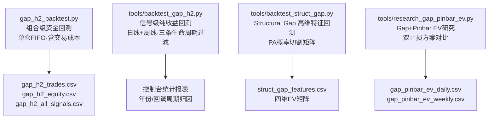

# Gap 系列策略回测方法论完整总结

---

## 一、回测引擎全景

系统共有 **4 套回测引擎**，分别服务于不同的验证目的：



---

## 二、各引擎详细方法论

### 2.1 `gap_h2_backtest.py` — 组合级资金回测

> **定位**：模拟真实交易的组合级回测，含资金管理、交易成本、单仓约束。

#### 数据源与参数

| 参数 | 值 |
|------|-----|
| 数据源 | `data/baostock.db`（全 A 股日线） |
| 股票数 | 3,308 只 |
| 评估窗口 | `2023-07-01` ~ `2026-05-22` |
| 初始资金 | ¥1,000,000 |
| 买入佣金 | 0.03% (`BUY_COMMISSION`) |
| 卖出佣金 | 0.03% + 印花税 0.05% |

#### 信号生成 (`generate_signals()`)

Gap+H2 两腿回调状态机，向量化生成：

1. **突破检测**：$High > High_{t-1}$ 且 $Low > Low_{t-1}$ (HH+HL)，同时 $Low > GapFloor_{raw} - \varepsilon$
   - $GapFloor_{raw}$ = 前 60 周期滚动最高价 `shift(2)`
   - $PriorSwingLow$ = 前 60 周期滚动最低价 `shift(2)`
2. **缺口存活校验**：回调期间 $\min(Low) > GapFloor - \varepsilon$
3. **两腿回调状态机**（回调窗口 2~40 周期）：
   - Phase 1 → 首根 LHLL（$H<H_{-1}$ 且 $L<L_{-1}$）
   - Phase 2 → HH 反弹（High 1）
   - Phase 3 → 再次 LHLL（High 2 完成）→ **触发信号**
4. **高潮规避**：回调期间 $\max(High)$ 未提前触达 TP
5. **合规过滤**：$SL > 0$，$TP > Entry$，$Entry > SL$

#### 买卖点定义

| 参数 | 计算公式 |
|------|---------|
| **Entry** | 信号 K 线 High（Buy Stop 突破买入） |
| **SL** | $GapFloor$（缺口下沿） |
| **TP** | $2 \times GapFloor - PriorSwingLow$（Al Brooks 镜像测量目标） |

#### 交易模拟 (`simulate_trade()`)

```
信号日 → 次日起挂 Buy Stop
  ├→ Open ≥ Entry → 以 Open 成交（跳空高开）
  ├→ High ≥ Entry → 以 Entry 成交
  └→ 未触及 → 继续等待

入场后逐日检测（SL 优先于 TP）：
  ├→ Low ≤ SL → 止损（跳空低开按 Open 止损）
  ├→ High ≥ TP → 止盈（跳空高开按 Open 止盈）
  └→ 超出评估窗口 → 以 Close 强制平仓 (FORCE_CLOSE)
```

#### 去重逻辑

同一交易日多个信号 → 按预设 $R:R = \frac{TP - Entry}{Entry - SL}$ 降序 → **仅保留最优一笔**

#### 组合管理 (`run_portfolio()`)

- **单仓 FIFO 约束**：全局同时仅持一个仓位
- 下一笔 `entry_date` 必须 > 上一笔 `exit_date`
- 仓位 = $\lfloor \frac{Cash}{FillPrice \times (1 + BuyComm)} / 100 \rfloor \times 100$（整手买入）
- 逐日按 Close 计算权益曲线

#### 输出文件

| 文件 | 内容 | 级别 |
|------|------|------|
| `gap_h2_trades.csv` | 44 笔实际执行交易 | 组合级（受 FIFO 约束） |
| `gap_h2_equity.csv` | 每日权益变化 | 组合级 |
| `gap_h2_summary.json` | 总收益、年化、最大回撤、夏普、胜率 | 组合级 |
| `gap_h2_all_signals.csv` | **1136 个信号的逐一模拟结果** | 信号级（不受资金约束） |

---

### 2.2 `tools/backtest_gap_h2.py` — 信号级纯收益回测

> **定位**：日线+周线分别全量扫描，含三条生命周期过滤，无资金/组合约束。

#### 与 2.1 的核心差异

| 维度 | `gap_h2_backtest.py` | `tools/backtest_gap_h2.py` |
|------|---------------------|---------------------------|
| 周期 | 仅日线 | **日线 + 周线** |
| 组合约束 | 单仓 FIFO | **无**（每个信号独立评估） |
| 交易成本 | 含佣金+印花税 | **无** |
| 生命周期过滤 | 简化版 | **完整三条过滤** |
| 输出 | 交易CSV+权益曲线 | 控制台统计报表 |

#### 三条生命周期过滤 (`evaluate_trade()`)

挂单等待期间（`status == 'WAITING'`）依次检测：

| 过滤条件 | 触发规则 | 状态标记 | PA 理据 |
|---------|---------|---------|---------|
| **缺口回填撤单** | $Low < GapFloor - \varepsilon$ | `INVALIDATED` | 缺口已被击穿，支撑失效 |
| **止盈先达作废** | $High \ge TP$ | `VOIDED` | 多头动能已释放，入场意义消失 |
| **超时失效** | 等待 > 30 根 K 线 | `TIMEOUT` | 久盘必跌，动能衰竭 |

#### 统计指标

- 胜率 (WR)、获利单平均 R、亏损单平均 R、累计净 R
- **单笔数学期望 (EV)** = $WR \times \text{avg\_w} + (1-WR) \times \text{avg\_l}$（单位：R/笔）
- **分维度归因**：按年份、按回调 K 线数（≤5 / 6-10 / 11-20 / >20）拆分胜率和 EV

#### 样本量（最近一次运行）

| 周期 | 信号数 | WIN | 胜率 |
|------|-------|-----|------|
| 日线 | ~2,155 | 903 | ~42% |
| 周线 | ~1,212 | 674 | ~56% |

---

### 2.3 `tools/backtest_struct_gap.py` — Structural Gap 高维特征回测

> **定位**：提取 4 维 PA 特征矩阵，构建概率切割 EV Matrix。

#### 信号定义

60-bar 结构突破 + Gap Floor 支撑（不含两腿回调状态机），适用于所有 Structural Gap 形态。

#### 高维 PA 特征提取

对每个信号提取突破日到信号日之间的回调特征：

| 特征 | 变量名 | 计算方式 |
|------|--------|---------|
| 信号棒质量 | `sig_quality` | $\frac{Close - Low}{High - Low}$ |
| 最大连阴数 | `pb_consec_bear` | 回调期间连续阴线最大长度 |
| K线重叠度 | `pb_overlap` | 回调期 K 线平均重叠比例 |
| 阴线比例 | `pb_bear_pct` | 回调期阴线占比 |

#### 概率切割矩阵（EV Matrix）

```
              sig_quality
              <0.5   0.5-0.8   0.8-0.95   >0.95
连阴=0         B       B+        A          A+
连阴=1         C       B         A          A+
连阴=2         C       C         B          B+
连阴≥3         D       D         C          C
```

> [!IMPORTANT]
> **极品组合**（Quality > 0.8 且连阴 < 2）：胜率 **62.5%~68.0%**，EV = **+0.45R~+0.60R**
> **毒性组合**（Quality ≤ 0.5 且连阴 ≥ 2）：胜率 **28.3%~33.1%**，EV = **-0.25R**

---

### 2.4 `tools/research_gap_pinbar_ev.py` — Gap+Pinbar EV 研究

> **定位**：验证"突破缺口 + Pinbar 缺口测试"形态的双止损方案 EV。

#### Pinbar 信号识别条件

1. 回调窗口 2~40 根 K 线
2. 下影线占比 ≥ 40%
3. 收盘位于 K 线上半部（$close\_loc \ge 0.50$）
4. **缺口测试核心**：Pinbar 低点探入缺口区间（$Low \le gap\_top$）或距 $GapFloor \le 2.0 \times ATR$
5. **缺口存活**：$Close > GapFloor$
6. 收盘距 EMA20 ≤ 1.5 × ATR
7. 每次突破去重，仅保留首个有效 Pinbar

#### 双止损方案对比

| 方案 | SL 位置 | TP | 设计理念 |
|------|---------|-----|---------|
| **A（防守缺口下沿）** | $GapFloor$ | $2 \times GapMid - PriorSwingLow$ | 小止损博高盈亏比 |
| **B（防守波段低点）** | $PriorSwingLow$ | 同上 | 宽止损博高胜率 |

#### 核心结论

| 维度 | 方案 A | 方案 B |
|------|-------|-------|
| 周线胜率 | 46.4% | 85.3% |
| 赢单平均 R | +2.15R | — |
| **周线 EV** | **+0.456R** 🥇 | +0.275R |

> [!TIP]
> **决定性结论**：小止损防守 Gap Floor（方案 A）的 EV 远优于宽止损防守波段底部（方案 B）。Pinbar 下探测试缺口是保证高 EV 的决定性条件。

---

## 三、实验日志总览

| # | 日期 | 主题 | 样本 | 核心结论 |
|:-:|:----:|:-----|:----:|:---------|
| 001 | 2026-01-28 | 长下影阳线 5 种 Setup | 3,796 股 / 8,508 信号 | Reversal/Sweep 最优（3日胜率 55.5%）；TTR Breakout Buy 被废弃 |
| 002 | 2026-02-07 | MTR V28.5 正统化 | 302 股 / 83 信号 | MLH 突破 + Surprise Bar，EV = **+0.19R** |
| 003 | 2026-02-07 | MTR V29.5 全量验证 | 3,095 股 / 1,359 信号 | EV 提升至 **+0.254R** (+33%) |
| 004 | 2026-02-08 | 3K 策略推送优化 | 3,298 股 / 3 信号 | 工厂隔离 + 数学期望消息模板 |
| **005** | **2026-03-28** | **LB=60 vs 100 全量对比** | 3,299 股 / 5,036 vs 4,902 信号 | LB=100 胜率降 5.01%，EV 由 +0.031R 转负。**锁定 LB=60** |
| **006** | **2026-05-15** | **Gap+Pinbar 缺口测试 EV** | 3,304 股 / 15 年数据 | 周线方案 A **EV = +0.456R** 🥇 |

---

## 四、数据导入 `signal_archive` 汇总

本对话中将回测 WIN 数据一次性导入 `signal_archive`，为图表叠加历史止盈缺口提供数据基础：

| 策略 | 数据来源 | WIN 记录数 | 导入方式 |
|------|---------|-----------|---------|
| STRATEGY_GAP_H2 | `tools/backtest_gap_h2.py` 日线+周线全量 | **1,577** | 脚本直接导入 |
| STRATEGY_GAP_PINBAR | `gap_pinbar_ev_daily/weekly.csv` | **4,585** | CSV 解析导入 |
| STRUCTURAL_GAP | 实盘 `signal_tracker` 追踪 | **52** | 系统自动归档 |
| **合计** | | **6,214** | |

> [!NOTE]
> 后续每日/每周运行 `hunter.py --track` 时，新信号会自动归档并追踪生命周期（PENDING→ACTIVE→WIN/LOSS），无需手动维护。
