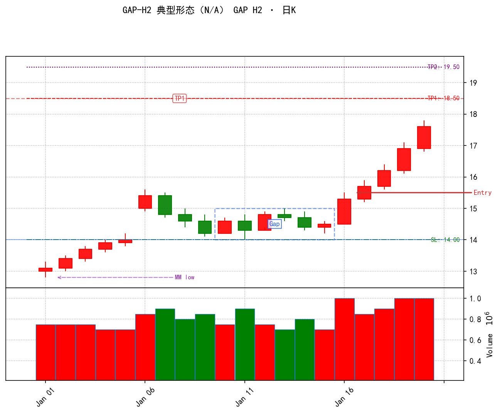

# GAP H2 策略卡（缺口 + 两腿回调）

> 按 PA 交易员思路分六类。评审时说「某类里的第 N 条 改成 ××」即可定位微调。

> 📊 **配图**：下图由项目出图工具（`notifier.generate_chart_bytes`）用**合成数据**生成，非真实个股。对照六类看：左侧红K上攻=一类背景（突破前高）→ 跳空真空区 + 蓝虚线框=开放缺口 → 中段绿K两次探地板（蓝线 SL 14.00）=二类回调两试 → 大红信号K（Entry 箭头 15.50）=三类信号 → 红线 TP1=当日2R、紫线 TP2=MM上翻=四类开仓三件套。左下"MM low"箭头指 MM 测量的起点（前摆低）。

> **生产 / 回测复盘 边界（重要，别搞混）**：真实每日扫描只做「四类开仓」的**提醒与标注**——信号K当天标出 Entry（信号K高点，固定 Buy Stop）+ 止损（缺口地板）+ 两个目标价（当日2R、MM上翻），次日开盘前**人工**挂突破条件单。**「动态挂单下移 → HH 收口成交 → 2R 止盈 → 新高跟踪止损」这一整套，只属于回测/复盘（五类），生产绝不执行。**

---

## 一、背景判断（这笔交易有没有"趋势 + 缺口"的地基）

| # | 规矩 | 现在怎么设 | 大白话 / 调它会怎样 |
|---|------|-----------|-------------------|
| 1 | 突破周期 | 看前 60 根 | 认定"趋势背景"的回溯窗口：价格要越过前 60 根最高点才算有背景。调大→更挑剔、信号更少。 |
| 2 | 真突破留缺口 | 突破K最低价须站上前 60 根最高点 | 留下一段"真空区"（缺口），是 H2 成立的地基；没留缺口直接不算。 |

## 二、回调过程（空头两试、缺口是否撑住、耗时多久）

| # | 规矩 | 现在怎么设 | 大白话 / 调它会怎样 |
|---|------|-----------|-------------------|
| 1 | 回调最长等 | 最多 40 根 | 突破后 40 根内没走完两试就作废。调大→能接住慢热的机会。 |
| 2 | 回调最短隔 | 至少 2 根 | 突破后至少等 2 根才允许出信号，防毛刺。一般不动。 |
| 3 | 地板不破 | 缺口下沿全程不破 | 回调途中任何一根都不能掉进缺口；破了=支撑失效，信号撤掉。 |
| 4 | 空头两试失败 | 先跌→涨破前高→再跌 | H2 核心形态：空头两次反扑都被打回。**第二腿完成那根就是信号 K**。 |

## 三、信号判断（排除高潮、看信号当根成色）

| # | 规矩 | 现在怎么设 | 大白话 / 调它会怎样 |
|---|------|-----------|-------------------|
| 1 | 涨太猛不追 | 信号前没先冲到目标 | 若已一口气涨到目标价=高潮释放，再进就晚了，作废。 |
| 2 | 信号当根长相 | 收盘越靠上越好 | 信号 K 收盘位置高=多头控盘。只影响打分，不决定出不出。 |

## 四、开仓计划（买点 / 止损 / 止盈三件套）

| # | 规矩 | 现在怎么设 | 大白话 / 调它会怎样 |
|---|------|-----------|-------------------|
| 1 | 买点 | 突破信号高点才买 | 次日挂 Buy Stop，涨过信号 K 最高价才成交，不提前追。 |
| 2 | 止损 | 破缺口下沿就跑 | 地板被跌破=突破失效，认赔离场。 |
| 3 | 目标价（两个） | 当日2R + MM上翻 | 生产图上同时标两个目标：**当日2R = 买点 + 2×(买点−地板)**（随买点定）；**MM上翻 = 2×地板−前摆低**（对称测量，固定）。挂单时心里有数。 |

## 五、持仓管理（回测专用，真实扫描不执行）

> 这一整类都**只用于回测模拟历史 / 复盘画图**，真实每日扫描**不执行**任何撤单、作废、超时、动态下移、止盈止损——生产只做四类的"当天提醒 + 标注"。

| # | 规矩 | 现在怎么设 | 大白话 / 调它会怎样 |
|---|------|-----------|-------------------|
| 1 | 【动态挂单下移】 | 信号K之后逐根跟踪 | 信号K（第二腿回调起点）先按信号K高点挂单；之后：阴跌K（高低点都降）→ 挂单下移到该K上方；高点抬升（HH）→ 按参考价收口成交；破地板/先到目标/超时30根 → 撤单。只在回测里模拟成交，生产不跑。 |
| 2 | 等入场超时 | 挂单 30 根没成则放弃 | 同上（回测专用）。 |
| 3 | 等待期破地板 | 撤单 | 同上。 |
| 4 | 等待期先到目标 | 作废 | 同上。 |
| 5 | 止损出场 | 破地板按地板/开盘价 | 同上。 |
| 6 | 止盈出场 | 到目标按目标价 | 同上。 |

## 六、其他约束（打分展示层，只改显示不改信号）

| # | 规矩 | 现在怎么设 | 大白话 / 调它会怎样 |
|---|------|-----------|-------------------|
| 1 | 收盘位置分 | 收盘越高加分 | 这 7 项只是**打分展示**，**不影响信号是否触发**，是后来加的。其中"两腿对称性"回测发现反着赢（经典浅回调在这策略是亏的），已自动反向扣分。 |
| 2 | 回调速度分 | 回得快加分 | 同上。 |
| 3 | 缺口宽度分 | 缺口越宽加分 | 同上。 |
| 4 | 连阴惩罚 | 回调阴线多扣分 | 同上。 |
| 5 | 时间衰减 | 拖太久扣分 | 同上。 |
| 6 | 缺口全程存活 | 一直没破加分 | 同上。 |
| 7 | 两腿对称性 | 浅回调反向扣分 | 同上。 |

---

### 怎么用
说「**二类第 3 条改成 ××**」或「**三类想加个条件**」，按类名 + 序号定位，先讲清改完信号变多还是变少、要不要连带动回测，再动手。

### 六类含义
- 一背景（地基）· 二回调（两试 + 缺口撑住）· 三信号（排高潮 + 看成色）· 四开仓（买卖止损）· 五持仓（回测专用）· 六其他（打分展示）
- 一 / 二 / 三 / 四 = **动一条就改信号**；五 = **回测专用**；六 = **打分展示，只改显示不改信号**
