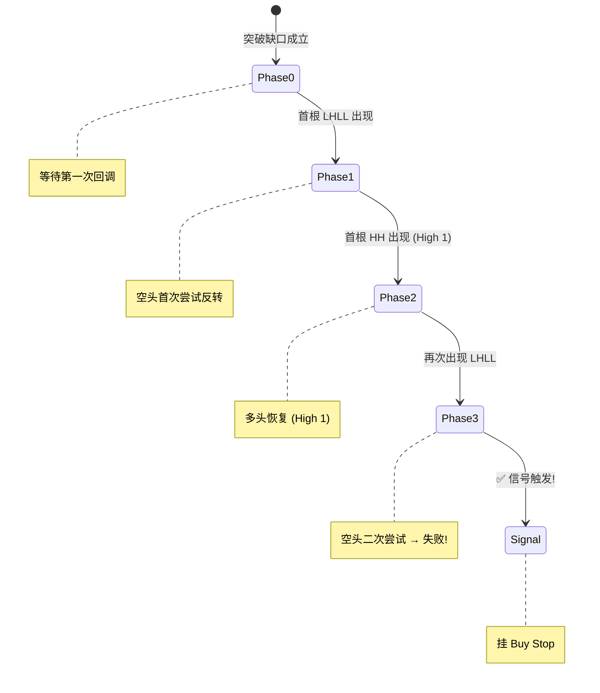

# Gap + High 2 (两腿回调) 策略说明书

> **策略版本**：Brooks-AI Quant System V9.15  
> **理论来源**：Al Brooks — *Price Action Trading Course*  
> **策略类型**：趋势延续型 · 顺势回调入场  
> **适用周期**：日线 / 周线  
> **最后更新**：2026-05-28  

---

## 一、策略概述

**Gap + High 2** 是基于 Al Brooks 价格行为理论中最经典的顺势入场模式之一。策略核心思想是：

> 在结构性突破缺口（Measuring Gap）成立后，等待空头**两次尝试反转均失败**，此时被困空头的止损盘将成为多头的燃料，形成高胜率的做多入场机会。

用一句话概括：**突破后回调两次，空头两次翻船，被迫认输平仓 → 我们在这里进场做多。**

---

## 二、理论基础

### 2.1 什么是 High 2？

在 Al Brooks 的体系中，**High 2** 是趋势中第二次回调后形成的做多信号：

| 术语 | 定义 |
|------|------|
| **High 1** | 趋势中第一次回调后的首根创新高 K 线 |
| **High 2** | 趋势中第二次回调后的首根创新高 K 线 |
| **LHLL** | Lower High + Lower Low — 一根同时创更低高点和更低低点的 K 线，代表回调特征 |
| **HH** | Higher High — 创更高高点的 K 线，代表多头恢复 |

### 2.2 为什么 High 2 有效？

```
        ┌── 突破 ──┐
        │          │   ┌── 第一次回调 (LHLL)
   ─────┘          └───┘
                        ↑ 空头首次尝试反转
                        │
              ┌── High 1 (HH) ──┐
              │                  │   ┌── 第二次回调 (LHLL) → 信号!
   ───────────┘                  └───┘
                                      ↑ 空头二次尝试反转
                                      │ → 两次失败 = 投降!
                                      │ → Buy Stop 挂在此处
```

**博弈逻辑**：
1. 突破后空头第一次尝试做空 → 价格恢复创新高 (High 1) → 第一批空头被套
2. 空头第二次尝试做空 → 价格再次恢复 → 第二批空头也被套
3. 两批被困空头的**止损买单**（平空 = 买入）同时涌入 → 形成多头爆发力

### 2.3 什么是结构性突破缺口？

结构性突破缺口（Structural Breakout Gap）= 价格一举跨越过去 **60 根 K 线**的最高点，且新 K 线的最低价高于之前的最高价，形成"缺口"区域。

> [!IMPORTANT]
> 缺口代表纯粹的价格失衡 — 一块未经充分交易的"处女地"。只要缺口**从未被击穿**（哪怕是影线），它就保持作为强支撑的有效性。

---

## 三、信号逻辑（四阶段状态机）

策略采用**向量化状态机**实现，全程无循环，确保在大规模回测中的计算效率。

### 3.1 状态机流程图



### 3.2 详细逻辑

| 阶段 | 条件 | PA 含义 |
|------|------|---------|
| **Phase 0** | K 线同时创更高高点 + 更高低点 (HH+HL)，且 Low > 过去 60 根最高价 | 结构性突破缺口成立 |
| **Phase 1** | 突破后首次出现 LHLL (Lower High + Lower Low) K 线 | 空头第一次尝试反转 |
| **Phase 2** | Phase 1 之后首次出现 HH (Higher High) K 线 | High 1 — 多头首次恢复 |
| **Phase 3** | Phase 2 之后首次出现 LHLL K 线 | 空头第二次尝试反转 → **信号!** |

### 3.3 五层过滤器

信号触发后，还需通过以下全部过滤条件：

| # | 过滤器 | 条件 | 目的 |
|---|--------|------|------|
| 1 | **时间窗口** | 突破后第 2~40 根 K 线内 | 过早/过晚的回调都不可靠 |
| 2 | **缺口存活** | 突破后所有 K 线的 Low > Gap Floor - ε | 缺口被击穿即失效 |
| 3 | **状态机通过** | LHLL → HH → LHLL 三阶段完成 | 确认两腿回调完成 |
| 4 | **高潮规避** | 组内最高价 < TP (目标位) | 避免追入已过热的行情 |
| 5 | **去重** | 每次突破仅取首次信号 | 防止重复信号 |

---

## 四、订单管理

### 4.1 入场

| 参数 | 规则 |
|------|------|
| **订单类型** | Buy Stop (突破买入) |
| **入场价** | 信号 K 线（第二次回调 LHLL）的最高点 (High) |
| **生效时间** | 信号 K 线的下一根 K 线 |

### 4.2 止损 (SL)

| 参数 | 规则 |
|------|------|
| **止损位** | Gap Floor (缺口下沿) |
| **逻辑** | 如果价格击穿缺口，整个交易论据（突破有效性）即被否定 |

### 4.3 止盈 (TP)

| 参数 | 规则 |
|------|------|
| **目标位** | `TP = 2 × Gap_Floor - Prior_Swing_Low` |
| **TP 倍数** | 2.0R |
| **逻辑** | 缺口上方的等距测量目标（Measured Move），Al Brooks 的经典 MM 公式 |

### 4.4 图解

```
                              TP = 2 × Gap_Floor - Prior_Swing_Low
                              ┌──── ─ ─ ─ ─ ─ ─ ─ ─ ─ ─ ─ ─ ─ ─ ─ ┐
                              │                                        
         ┌──────┐             │         ┌──────┐                       
         │      │   ┌────┐    │    ┌────┤      │                       
    ┌────┤      │   │    │    │    │    │      │                       
    │    │      ├───┤    ├────│────┤    │      │                       
 ───┤    │      │   │    │    │    │    │      │                       
    │    │      │   │    │   ...   │    │      │                       
════╪════╧══════╧═══╧════╧════╧════╧════╧══════╧══  Gap Floor (SL)
    │                                                                  
    │   Prior Swing Low                                               
 ───┘                                                                  
```

---

## 五、信号质量评估

### 5.1 K 线质量指标

每根信号 K 线都会计算一个质量分数：

```
质量分数 = (Close - Low) / (High - Low)
```

| 分数区间 | 含义 |
|----------|------|
| 0.7 ~ 1.0 | 优质 — 收盘在 K 线上部，多头控制力强 |
| 0.4 ~ 0.7 | 一般 — 多空拉锯 |
| 0.0 ~ 0.4 | 劣质 — 收盘在 K 线下部，空头仍有抵抗 |

### 5.2 四因子 EV 评级

系统还会综合以下四个维度，对信号进行 A+ / A / B / C / D 五级评级：

| 因子 | 权重 | 评估内容 |
|------|:----:|----------|
| 回调速度 | 25% | 回调越快（急跌急恢复），被困空头越恐慌 |
| 缺口宽度 | 25% | 缺口越宽，支撑越强 |
| 信号 K 质量 | 25% | 收盘位置越高越好 |
| 连续阴线 | 25% | 回调中连续阴线过多 → 扣分 |

---

## 六、回测绩效

### 6.1 回测环境

| 参数 | 值 |
|------|-----|
| **标的范围** | 全 A 股 — 3,308 只 |
| **评估窗口** | 2023-07-01 ~ 2026-05-22 (约 35 个月) |
| **初始资金** | ¥1,000,000 |
| **仓位管理** | 单仓 FIFO (同时仅持有一个仓位) |
| **交易成本** | 买入佣金 3bps + 卖出佣金 3bps + 印花税 5bps |
| **手数限制** | A 股标准 100 股整数倍 |

### 6.2 核心指标

| 指标 | 数值 | 评价 |
|------|:----:|------|
| **总收益率** | **+405.07%** | ¥100万 → ¥505万 |
| **年化收益率** | **+79.45%** | 远超市场平均 |
| **最大回撤** | **-43.51%** | 需关注风险管理 |
| **Sharpe Ratio** | **1.457** | 优秀 (>1.0 即可接受) |
| **胜率** | **47.73%** | 接近 50%，靠盈亏比取胜 |
| **总交易笔数** | **44 笔** | 平均约 24 天/笔 |

### 6.3 盈亏分布

| 类别 | 笔数 | 占比 |
|------|:----:|:----:|
| 盈利交易 | 21 | 47.7% |
| 亏损交易 | 23 | 52.3% |

> [!TIP]
> 虽然胜率略低于 50%，但策略通过**盈利交易的平均幅度远大于亏损交易**来实现总体盈利。这是典型的趋势跟踪型策略特征——靠"截断亏损，让利润奔跑"取胜。

### 6.4 逐笔交易记录

> 以下为回测中实际执行的 44 笔交易（单仓 FIFO 模式，已扣除佣金和印花税）：

| # | 入场日 | 出场日 | 代码 | 方向 | 持仓量 | 入场价 | 出场价 | 盈亏(元) | 盈亏% | 持仓天数 |
|:-:|--------|--------|------|:----:|-------:|-------:|-------:|----------:|------:|:--------:|
| 1 | 2023-07-05 | 2024-01-02 | 605599 | 多 | 82,100 | 12.17 | 13.83 | +134,331 | +13.44% | 122 |
| 2 | 2024-01-05 | 2024-01-18 | 601168 | 多 | 83,600 | 13.55 | 12.62 | -79,199 | -6.99% | 9 |
| 3 | 2024-01-19 | 2024-01-22 | 002779 | 多 | 50,500 | 20.86 | 19.71 | -59,167 | -5.62% | 1 |
| 4 | 2024-01-23 | 2024-02-20 | 601225 | 多 | 49,100 | 20.27 | 22.84 | +125,364 | +12.60% | 14 |
| 5 | 2024-02-23 | 2024-03-07 | 000933 | 多 | 65,200 | 17.19 | 18.53 | +86,332 | +7.70% | 9 |
| 6 | 2024-03-08 | 2024-03-13 | 600875 | 多 | 77,100 | 15.65 | 15.27 | -30,656 | -2.54% | 3 |
| 7 | 2024-03-15 | 2024-04-25 | 000550 | 多 | 45,700 | 25.75 | 23.97 | -82,393 | -7.00% | 27 |
| 8 | 2024-04-29 | 2024-04-30 | 600761 | 多 | 48,100 | 22.71 | 21.71 | -49,268 | -4.51% | 1 |
| 9 | 2024-05-07 | 2024-05-15 | 601998 | 多 | 169,900 | 6.15 | 6.04 | -19,263 | -1.84% | 6 |
| 10 | 2024-05-16 | 2024-06-13 | 002938 | 多 | 37,900 | 27.01 | 32.59 | +209,967 | +20.50% | 19 |
| 11 | 2024-06-20 | 2024-06-21 | 603324 | 多 | 51,400 | 24.00 | 22.77 | -64,672 | -5.24% | 1 |
| 12 | 2024-06-24 | 2024-07-22 | 001286 | 多 | 106,200 | 11.03 | 10.51 | -56,309 | -4.81% | 20 |
| 13 | 2024-07-23 | 2024-08-29 | 600025 | 多 | 96,000 | 11.60 | 10.87 | -71,729 | -6.44% | 27 |
| 14 | 2024-09-03 | 2024-09-05 | 603189 | 多 | 83,200 | 12.53 | 13.73 | +98,431 | +9.44% | 2 |
| 15 | 2024-09-19 | 2024-09-25 | 603822 | 多 | 45,500 | 25.08 | 28.70 | +163,323 | +14.31% | 4 |
| 16 | 2024-09-27 | 2024-09-30 | 600660 | 多 | 25,700 | 50.65 | 55.12 | +113,543 | +8.72% | 1 |
| 17 | 2024-10-14 | 2024-10-15 | 000935 | 多 | 97,800 | 14.50 | 15.50 | +96,162 | +6.78% | 1 |
| 18 | 2024-10-16 | 2024-10-29 | 600340 | 多 | 1,016,300 | 1.49 | 1.88 | +394,374 | +26.04% | 9 |
| 19 | 2024-10-30 | 2024-11-18 | 000628 | 多 | 27,500 | 69.22 | 58.69 | -291,385 | -15.30% | 13 |
| 20 | 2024-11-20 | 2024-11-25 | 603090 | 多 | 84,000 | 19.25 | 17.77 | -126,075 | -7.79% | 3 |
| 21 | 2024-11-26 | 2024-12-19 | 603110 | 多 | 86,500 | 17.24 | 15.65 | -138,633 | -9.30% | 17 |
| 22 | 2024-12-23 | 2024-12-24 | 002864 | 多 | 42,600 | 31.69 | 29.59 | -90,477 | -6.70% | 1 |
| 23 | 2025-01-23 | 2025-02-05 | 002536 | 多 | 96,900 | 13.02 | 12.43 | -58,262 | -4.62% | 3 |
| 24 | 2025-02-06 | 2025-03-28 | 002967 | 多 | 65,900 | 18.27 | 20.42 | +140,860 | +11.70% | 36 |
| 25 | 2025-03-31 | 2025-04-07 | 002233 | 多 | 174,000 | 7.73 | 7.51 | -39,294 | -2.92% | 4 |
| 26 | 2025-04-16 | 2025-04-28 | 000677 | 多 | 283,100 | 4.61 | 4.29 | -91,955 | -7.04% | 8 |
| 27 | 2025-04-29 | 2025-05-12 | 002294 | 多 | 30,900 | 39.17 | 36.47 | -84,537 | -6.98% | 6 |
| 28 | 2025-05-13 | 2025-05-26 | 002734 | 多 | 83,600 | 13.50 | 16.67 | +263,032 | +23.29% | 9 |
| 29 | 2025-05-27 | 2025-05-29 | 603839 | 多 | 195,900 | 7.10 | 8.48 | +268,811 | +19.31% | 2 |
| 30 | 2025-05-30 | 2025-06-05 | 003010 | 多 | 49,400 | 33.59 | 40.38 | +333,219 | +20.07% | 3 |
| 31 | 2025-06-09 | 2025-06-18 | 002215 | 多 | 176,600 | 11.29 | 10.87 | -75,529 | -3.79% | 7 |
| 32 | 2025-06-19 | 2025-07-29 | 002317 | 多 | 124,700 | 15.38 | 18.67 | +407,414 | +21.24% | 28 |
| 33 | 2025-07-30 | 2025-09-01 | 600389 | 多 | 103,800 | 22.40 | 26.23 | +394,886 | +16.98% | 23 |
| 34 | 2025-09-02 | 2025-09-18 | 600869 | 多 | 387,500 | 7.02 | 7.80 | +299,016 | +10.99% | 12 |
| 35 | 2025-09-19 | 2025-09-22 | 601872 | 多 | 339,400 | 8.90 | 8.40 | -171,495 | -5.68% | 1 |
| 36 | 2025-09-24 | 2025-10-21 | 605287 | 多 | 132,700 | 21.45 | 26.74 | +698,290 | +24.52% | 13 |
| 37 | 2025-10-24 | 2025-12-24 | 600801 | 多 | 174,300 | 20.33 | 24.56 | +731,843 | +20.64% | 43 |
| 38 | 2025-12-29 | 2026-01-28 | 600115 | 多 | 761,100 | 5.62 | 5.48 | -111,174 | -2.60% | 20 |
| 39 | 2026-01-29 | 2026-03-04 | 603730 | 多 | 399,800 | 10.42 | 9.54 | -356,125 | -8.55% | 18 |
| 40 | 2026-03-05 | 2026-03-09 | 605589 | 多 | 106,500 | 35.75 | 33.02 | -294,701 | -7.74% | 2 |
| 41 | 2026-03-10 | 2026-03-12 | 600172 | 多 | 374,000 | 9.40 | 11.57 | +807,064 | +22.95% | 2 |
| 42 | 2026-03-16 | 2026-03-20 | 002140 | 多 | 294,800 | 14.66 | 13.23 | -425,981 | -9.85% | 4 |
| 43 | 2026-03-27 | 2026-05-14 | 001896 | 多 | 242,700 | 16.05 | 19.10 | +735,358 | +18.87% | 30 |
| 44 | 2026-05-15 | 2026-05-22 | 002496 | 多 | 1,921,900 | 2.41 | 2.63 | +417,385 | +9.01% | 5 |

### 6.5 权益曲线概览

```
资金 (万元)
 505 ┤                                                          ╭──
     │                                                       ╭──╯
 450 ┤                                                    ╭──╯
     │                                                 ╭──╯
 400 ┤                                              ╭──╯
     │                                           ╭──╯
 350 ┤                                      ╭────╯
     │                                 ╭────╯
 300 ┤                              ╭──╯
     │                           ╭──╯
 250 ┤                        ╭──╯
     │                     ╭──╯
 200 ┤                  ╭──╯
     │            ╭─────╯
 150 ┤      ╭─────╯
     │   ╭──╯
 100 ┤───╯
     └──────────────────────────────────────────────────────────
      2023.07      2024.01      2024.07      2025.01      2025.07      2026.01
```

---

## 七、策略优势与风险

### 7.1 核心优势

| 优势 | 说明 |
|------|------|
| 🎯 **理论基础扎实** | Al Brooks 两腿回调 (H2) 是数十年实盘验证的经典 PA 形态 |
| ⚡ **博弈逻辑清晰** | 被困空头的止损盘提供确定性的多头燃料 |
| 🛡️ **止损逻辑明确** | SL = 缺口下沿，交易论据否定 = 立即退出 |
| 📐 **目标位有据** | TP 基于 Measured Move 数学公式，非主观判断 |
| 🔬 **全向量化** | 信号计算零循环，支持大规模跨市场扫描 |

### 7.2 主要风险

| 风险 | 说明 | 应对 |
|------|------|------|
| 📉 **回撤较大** | 最大回撤 43.51%，可能出现连续亏损 | 建议搭配仓位管理，单笔风险控制在 1-2% |
| 📊 **胜率略低** | 47.73%，依赖盈亏比而非高胜率 | 严格执行止盈止损纪律 |
| ⏳ **信号稀少** | 35 个月仅 44 笔，平均 24 天/笔 | 可与其他策略组合使用 |
| 🔄 **缺口依赖** | 横盘市场中突破缺口较少 | 适合在趋势性市场环境中使用 |

---

## 八、策略参数一览

| 参数 | 默认值 | 说明 |
|------|:------:|------|
| `LOOKBACK_WINDOW` | 60 | 突破判定窗口 (日线≈3个月) |
| `MAX_PULLBACK_WINDOW` | 40 | 回调确认最大跟踪窗口 |
| `MIN_PULLBACK_WINDOW` | 2 | 回调确认最小窗口 |
| TP 倍数 | 2.0R | `2 × Gap_Floor - Prior_Swing_Low` |
| SL | — | Gap Floor (缺口下沿) |
| 入场方式 | Buy Stop | 挂在信号 K 线最高点 |

---

## 九、使用场景建议

| 场景 | 推荐度 | 说明 |
|------|:------:|------|
| 牛市/结构性上涨 | ⭐⭐⭐⭐⭐ | 突破频繁，信号丰富 |
| 震荡市 | ⭐⭐ | 突破多为假突破，信号减少 |
| 熊市 | ⭐ | 做多策略在熊市中天然受限 |
| 日线交易 | ⭐⭐⭐⭐⭐ | 默认设计周期 |
| 周线交易 | ⭐⭐⭐⭐ | 已适配，信号更少但质量更高 |

---

## 十、与系统内其他策略的关系

本策略是 Brooks-AI 量化系统中**缺口策略家族**的成员之一：

| 策略 | 信号类型 | 特点 |
|------|----------|------|
| **Structural Gap** (结构性缺口) | 缺口本身 | 最原始的突破信号 |
| **Gap + Pinbar** | 缺口 + EMA20 Pinbar | 用影线刺穿 EMA20 确认 |
| **Gap + H2** (本策略) | 缺口 + 两腿回调 | 等待空头两次失败后入场 |

三者共享相同的突破识别、缺口存活监控和高潮规避逻辑，仅在**入场确认信号**上有所不同。

---

> [!NOTE]
> 本文档基于 Brooks-AI Quant System V9.15 代码和回测数据生成。回测结果基于历史数据，不代表未来收益。实际交易中请结合市场环境和个人风险承受能力做出决策。

---

*策略设计：Al Brooks Price Action 理论*  
*系统实现：Brooks-AI Quant System*  
*文档生成：2026-05-28*
