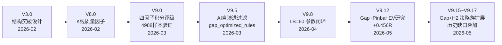
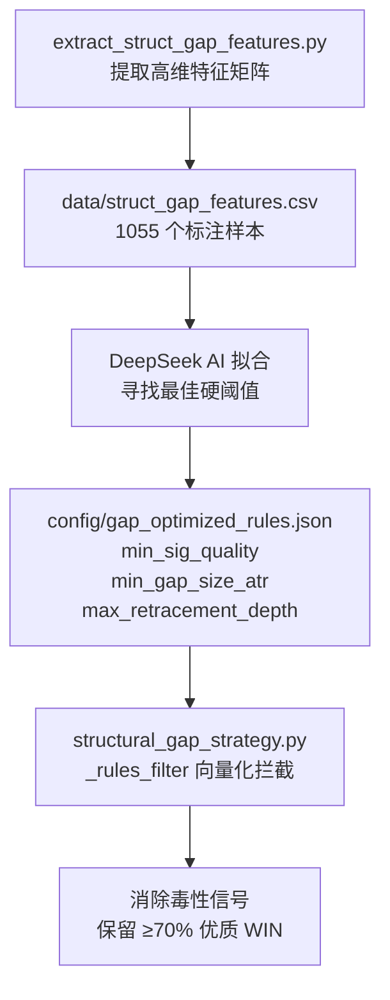

# Gap Structural 策略评级体系演进简报

> 基于项目全量代码、文档、回测数据及历史对话的综合分析

---

## 一、演进总览

---

## 二、核心理论基础

**Al Brooks Measuring Gap（测量缺口）原理**：价格超越过去 60 根 K 线最高点形成"处女地"缺口，只要 `Low > Gap Floor` 未被击穿，即构成纯粹失衡的强支撑区。

| 参数 | 定义 |
|------|------|
| **Gap Floor** | 60 根 K 线滚动最高价（shift 2 锚定） |
| **Prior Swing Low** | 60 根 K 线滚动最低价 |
| **Entry** | 确认反转 K 线 High（Buy Stop） |
| **SL** | Gap Floor（缺口下沿） |
| **TP** | $2 \times GapMid - PriorSwingLow$（镜像测量目标） |

---

## 三、四因子积分评级体系（V9.0 核心）

### 因子定义与计分规则

| # | 因子 | 变量名 | 加分条件 | 扣分条件 | PA 理据 |
|:-:|:-----|:-------|:---------|:---------|:--------|
| 1 | **回调速度** | `pb_bars` | ≤4 周期 → **+2** | >7 周期 → **-2** | 急跌急复 = 空头被套恐慌 |
| 2 | **缺口宽度** | `gap_size_pct` | >7% → **+2** | <3% → **-1** | 宽缺口 = 剧烈失衡强支撑 |
| 3 | **K线质量** | `sig_bar_quality` | >0.8 → **+1** | <0.5 → **-1** | $q = \frac{Close-Low}{High-Low}$，收在顶部=多头掌控 |
| 4 | **连阴扣分** | `pb_consec_bear` | — | ≥3 根 → **-1** | 连续抛压=动能衰竭 |
| 附 | **时间衰减** | `bars_passed` | — | >5周期 -1，>10周期 -2 | 久盘必跌 |

### 评级映射表

| 评级 | 名称 | 积分 (`ev_score`) | 操作建议 |
|:---:|:-----|:-----------------:|:---------|
| **A+** | 🌟🌟 极品 | ≥ +3 | 最高优先级，全量图表推送 |
| **A** | 🌟 高预期 | = +2 | 优质标的，重点观察挂单 |
| **B** | 👍 常态 | 0 ~ +1 | 标准形态，正常执行 |
| **C** | ⚠️ 低预期 | -2 ~ -1 | 瑕疵形态，收缩止盈 |
| **D** | 💀 毒性 | < -2 | 系统建议拦截跳过 |

---

## 四、回测验证与 EV 研究关键结论

### 4.1 大样本基准验证（V9.0，4988 样本）

| 指标 | 数值 |
|------|------|
| 样本规模 | **4,988** 个缺口突破样本（全 A 股 3299+ 只，6 年日线+周线） |
| 基准胜率 | 47.7% ~ 49.5% |
| 获利单平均 R | +2.2R ~ +2.5R |
| 亏损单平均 R | -1.0R |
| 全局基准 EV | **+0.031R ~ +0.15R / 笔**（天然正期望） |

### 4.2 评级分层后的概率切割（1,055 个深度标注样本）

| 组合特征 | 胜率 | 单笔 EV | 结论 |
|:---------|:----:|:-------:|:-----|
| **极品组合**：Quality > 0.8 且连阴 < 2 | **62.5% ~ 68.0%** | **+0.45R ~ +0.60R** | 高胜率高盈亏比 |
| **毒性组合**：Quality ≤ 0.5 且连阴 ≥ 2 | 28.3% ~ 33.1% | **-0.25R** | 典型被套陷阱 |

> [!IMPORTANT]
> **核心发现**：四因子积分评级能有效将基准 EV 从 +0.03R 提升至 A+ 级的 +0.6R，同时识别并拦截 EV 为负的 D 级毒性信号。

### 4.3 LOOKBACK 参数对比（V9.8 闭环）

| LOOKBACK | 胜率 | EV | 信号量 | 结论 |
|:--------:|:----:|:--:|:------:|:-----|
| **60（采用）** | 49.57% | +0.031R | 适中 | ✅ 平衡突破强度与交易机会 |
| 100 | 50.12% | 略高 | 减少 40% | ❌ 错失大量中级突破 |

### 4.4 Gap+Pinbar EV 专项（V9.12）

- 周线 "突破缺口 + 缺口测试 Pinbar + Gap Floor 止损" → **+0.456R / 笔**
- 证明 Gap Floor 紧贴止损远优于波段大底宽止损

### 4.5 Gap+H2 全量回测（V9.15~V9.17）

| 周期 | 信号总数 | 止盈(TP) | 止损(SL) | 胜率 |
|:----:|:-------:|:--------:|:--------:|:----:|
| 日线 | ~2155 | 903 | — | ~42% |
| 周线 | ~1212 | 674 | — | ~56% |

---

## 五、AI 自演进过滤机制（V9.5）

> [!NOTE]
> 策略类在 `__init__` 时自动加载 `gap_optimized_rules.json`，在 `calculate_signals()` 中对信号施加 `_rules_filter` 过滤，无需手动干预。

---

## 六、版本迭代时间线

| 版本 | 日期 | 评级体系关键突破 |
|:---:|:---:|:---|
| V3.0 | 2026-02-22 | 确立 60-bar 结构突破 + Gap Floor 硬约束 |
| V8.0 | 2026-02-22 | 引入 K 线质量分 `sig_bar_quality` |
| **V9.0** | **2026-03-01** | **四因子积分评级体系上线**，4988 样本鲁棒性验证 |
| V9.5 | 2026-03-09 | AI 自演进过滤器 + `gap_optimized_rules.json` 动态配置 |
| V9.8 | 2026-04-04 | LB=60 vs 100 全量对比，确认 60 为最优 |
| V9.12 | 2026-05-15 | Gap+Pinbar EV 研究：周线 +0.456R（实验 #006） |
| V9.15 | 2026-05-24 | Gap+H2 两腿回调策略族扩展 |
| **V9.16** | **2026-05-27** | **推送层按评级分组重构**（A+/A 详细推送，B/C 压缩汇总，D 拦截） |
| V9.17 | 2026-05-31 | 历史止盈缺口图表叠加，6214 条 WIN 导入 |

---

## 七、关键文件索引

| 用途 | 文件 |
|------|------|
| 用途 | 文件 |
|------|------|
| 评级逻辑实现 | [structural_gap_strategy.py](file:///d:/life/Trading%20view/_Project_A/Data_from_Akshare/debugV7.1_for_antigravity/core/strategies/structural_gap_strategy.py) |
| 周线扫描评级（四因子计算 L210-234） | [scanner_weekly_gap.py](file:///d:/life/Trading%20view/_Project_A/Data_from_Akshare/debugV7.1_for_antigravity/tools/scanner_weekly_gap.py) |
| AI 过滤规则配置 | [gap_optimized_rules.json](file:///d:/life/Trading%20view/_Project_A/Data_from_Akshare/debugV7.1_for_antigravity/config/gap_optimized_rules.json) |
| 回测特征矩阵（1055 样本） | [struct_gap_features.csv](file:///d:/life/Trading%20view/_Project_A/Data_from_Akshare/debugV7.1_for_antigravity/data/struct_gap_features.csv) |
| Gap 策略演进路线图 | [gap_evolution_plan.md](file:///d:/life/Trading%20view/_Project_A/Data_from_Akshare/debugV7.1_for_antigravity/docs/gap_evolution_plan.md) |
| Gap 策略规范文档（评级公式 Sec 4） | [brooks_ai_gap_strategy_spec.md](file:///d:/life/Trading%20view/_Project_A/Data_from_Akshare/debugV7.1_for_antigravity/docs/brooks_ai_gap_strategy_spec.md) |
| 日线回测脚本 | [backtest_struct_gap.py](file:///d:/life/Trading%20view/_Project_A/Data_from_Akshare/debugV7.1_for_antigravity/tools/backtest_struct_gap.py) |
| 周线回测报告 | [weekly_gap_backtest_report.csv](file:///d:/life/Trading%20view/_Project_A/Data_from_Akshare/debugV7.1_for_antigravity/data/weekly_gap_backtest_report.csv) |
| 特征提取脚本 | [extract_struct_gap_features.py](file:///d:/life/Trading%20view/_Project_A/Data_from_Akshare/debugV7.1_for_antigravity/tools/extract_struct_gap_features.py) |
| 特征分箱分析 | [analyze_struct_gap_features.py](file:///d:/life/Trading%20view/_Project_A/Data_from_Akshare/debugV7.1_for_antigravity/tools/analyze_struct_gap_features.py) |
| AI 策略演进引擎 | [evolve_gap_strategy.py](file:///d:/life/Trading%20view/_Project_A/Data_from_Akshare/debugV7.1_for_antigravity/tools/evolve_gap_strategy.py) |
| Gap+Pinbar EV 研究 | [research_gap_pinbar_ev.py](file:///d:/life/Trading%20view/_Project_A/Data_from_Akshare/debugV7.1_for_antigravity/tools/research_gap_pinbar_ev.py) |
| 实验日志（#005 LB对比, #006 Pinbar EV） | [EXPERIMENT_LOG.md](file:///d:/life/Trading%20view/_Project_A/Data_from_Akshare/debugV7.1_for_antigravity/strategy_lab/EXPERIMENT_LOG.md) |
