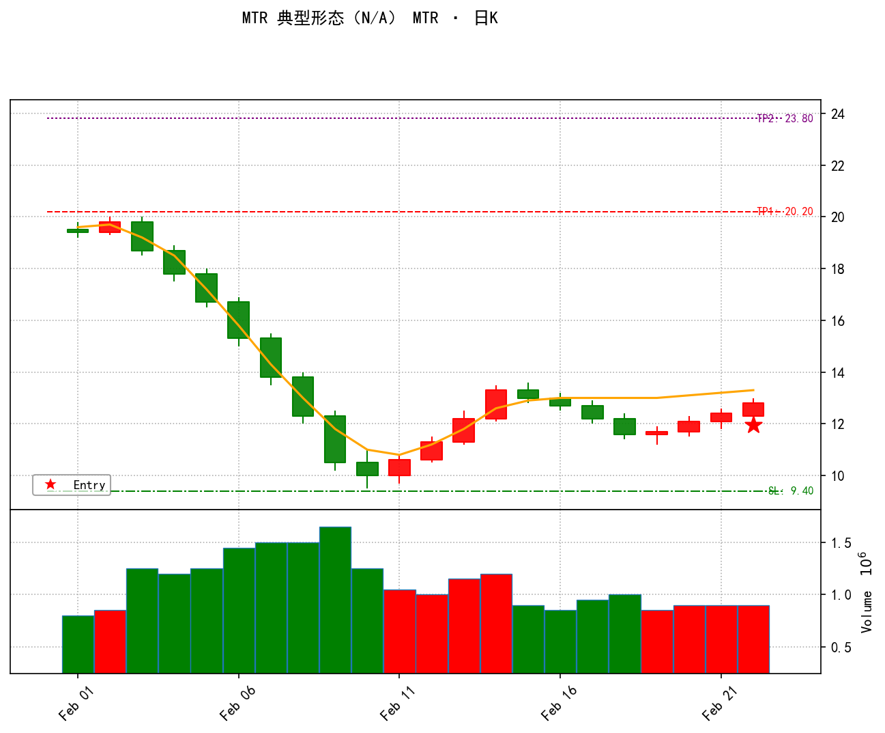

# MTR 策略卡（Major Trend Reversal 主趋势反转）

> 按 PA 交易员思路分六类。评审时说「某类里的第 N 条 改成 ××」即可定位微调。
> 本卡**逐条对照生产代码核实**（代码位置见各条括号），核实日期 2026-09-22。
> 原 `docs/MTR_V35_0_STRATEGY.md` 是历史 spec，已和代码多处漂移，本卡以代码为准。

> ⚠️ **现状核实 / 文档漂移警告**（看卡前先读这段）
> 1. **版本号三处对不上**：spec 文档标题写 V35.1、类 `mtr_strategy.py` 注释写 V30.0/描述写 V35.0、真正干活的结构引擎 `mtr_structural_v35.py` 注释已到 V36.x。当前生产跑的是**引擎 V36.x 那套逻辑**，对外注册名 `MTR_V35_STRUCTURAL`、展示名 `MTR`。
> 2. **第一腿反弹上限漂移**：spec/旧描述写 (H1−L1)/(H0−L1) 上限 0.618；**代码实际是 0.786**（`mtr_structural_v35.py:31`，V36.1 放宽）。本卡按 0.786 写。
> 3. **"AI 参谋"没接进生产**：spec 写"Python找结构→AI审计→人工决策"三段式，但 `get_metadata()` 里 `ai_audit: False`（`mtr_strategy.py:60`），日线扫描**不跑 DeepSeek 二次审计**，`format_prompt/parse_result` 只是保留接口（同 gap_h2/结构缺口等策略）。真实流程=Python找结构+人工在 TradingView 精筛+券商下单（与项目红线一致）。
> 4. **趋势线突破检测已弃用**：`GeometricTrendlineEngine` 和 `_check_trendline_break` 仍在文件里，但匹配时不调用，改用"EMA 缺口K"当突破证据（`mtr_structural_v35.py:305-308` 标 DEPRECATED）。
> 5. **H2 不扫描**：V35.0 起不再硬性识别第二高点，H2 交人工在图上自行构建；引擎里 H2 字段恒为 None（`mtr_structural_v35.py:194`）。

> **生产 / 人工 边界（重要，别搞混）**：每日扫描只做"找结构 + 提醒 + 标注（信号K、买点、止损、两目标）"。买点是信号K高点的 Buy Stop（突破才成交），止损/目标画在图上，**次日开盘前人工挂条件单**；持仓管理（动态止盈/跟踪止损）由人工在券商做，生产绝不执行。

> 📊 **配图**：下图由项目出图工具（`notifier.generate_chart_bytes`）用**合成数据**生成，非真实个股。对照六类看：左上 H0 主高（EMA20 上方）→ 一路阴跌至 L1 极值（卖压高潮，橙线 EMA20 全程压在价格上方）→ 第一腿反弹上穿 EMA20（H1，性质改变，二类）→ 回调 TL 回到 EMA 下方踩前低（三类）→ 末端红星 Entry=信号K（强阳收盘上半部）→ 绿线 SL=min(L1,TL)、红线 TP1=2R、紫线 TP2=3R（四类）。

---

## 一、背景判断（这是不是一段"够狠"的下跌主趋势）

| # | 规矩 | 现在怎么设 | 大白话 / 调它会怎样 |
|---|------|-----------|-------------------|
| 1 | 趋势深度门槛 | L1 比近期最高跌 ≥ 5 ATR（trend_depth≥5.0） | 跌得不够深只是正常回调，不算"主趋势反转"候选。`mtr_strategy.py:284-287` 直接跳过。调大→更挑、信号更少。 |
| 2 | H0 是真正的高点 | H0 价格=区间内最高，且 H0 那根K的 high 在 EMA20 上方 | 确保我们是从一段明确下跌里找反转，小反弹的高点不算。`mtr_structural_v35.py:92-98`。 |
| 3 | 下跌够"纯" | H0→L1 区间 ≥55% 的K线收盘在 EMA20 下方 | 这段下跌要干净利落，别夹一堆反弹。`_validate_stage_1_np`（`mtr_structural_v35.py:280-283`）。调高→要求更极端的主跌。 |

## 二、第一腿突破（L1→H1：空头第一次被打退，叫"性质改变 / Change of Character"）

| # | 规矩 | 现在怎么设 | 大白话 / 调它会怎样 |
|---|------|-----------|-------------------|
| 1 | 反弹幅度（斐波那契） | (H1−L1)/(H0−L1) 在 **0.382~0.786** | 从最低点反弹的高度，占整段跌幅的 38%~79%。太小=熊旗继续跌；太大=V型反转不算MTR。`mtr_structural_v35.py:30-31`。⚠️ 文档写 0.618，代码实际 0.786。 |
| 2 | 至少 1 根 EMA 缺口K | L1→H1 区间至少一根K的 low > EMA20 | 多头得有根K线整根站在均线之上，证明它真发力了（不止收盘蹭上去）。`mtr_structural_v35.py:296-299`。 |
| 3 | H1 收盘站上 EMA20 | H1 那根K收盘 > EMA20 | 反弹最高点收在均线之上，确认突破成功。`mtr_structural_v35.py:300-303`。 |
| 4 | 耗时最短 | L1→H1 ≥ 3 根 | 至少涨 3 天，排除单日脉冲。`MIN_BARS["L1_to_H1"]=3`（`mtr_structural_v35.py:24-25`）。 |

## 三、回调测试（H1→TL：多头回来踩一脚前低，叫"测试 / Test"）

| # | 规矩 | 现在怎么设 | 大白话 / 调它会怎样 |
|---|------|-----------|-------------------|
| 1 | 回撤深度（斐波那契） | (H1−TL)/(H1−L1) 在 0.500~0.786 | 从第一腿高点回吐的幅度，占第一腿涨幅的 50%~79%。太浅=可能直接起飞变盘整；太深=破位风险大。`mtr_structural_v35.py:32`。 |
| 2 | TL 回到空头地盘 | TL 那根K收盘在 EMA20 下方 | 回调要真正回到均线下方测试，停在均线上方不算数。`mtr_structural_v35.py:171`。 |
| 3 | 耗时最短 | H1→TL ≥ 2 根 | 回调至少走 2 天。`MIN_BARS["H1_to_TL"]=2`。 |
| 4 | 别跌太狠 | H1 之后最低价不能破 L1×0.80 | 回调跌破前低太多，这轮反转尝试就废了，标记过期不再追。`mtr_structural_v35.py:144`。调大→更宽容、能接住深回调。 |

## 四、开仓计划（买点 / 止损 / 止盈三件套）

| # | 规矩 | 现在怎么设 | 大白话 / 调它会怎样 |
|---|------|-----------|-------------------|
| 1 | 买点 | 信号K**最高价**挂 Buy Stop（突破才买） | 信号K定义：TL 之后出现阳线且收盘在K线上半部（最多往后找 16 根）。等一根像样的阳线确认止跌，涨过它最高价才成交。`_find_signal_bar`（`mtr_structural_v35.py:225-278`）；买点写入 `mtr_entry_price`（`mtr_strategy.py:299,342`）。 |
| 2 | 止损 | min(L1最低价, TL测试价) − 1 分 | 跌破前低或测试低点就跑，认赔。`get_sl`（`mtr_strategy.py:329-338`）。 |
| 3 | 目标价（两个） | TP1 = 买点 + 2R；TP2 = 买点 + 3R（R=买点−止损） | 第一目标赚 2 倍风险，第二目标 3 倍；正常 MTR 给到 2R 就够。`mtr_strategy.py:346-348`。 |

## 五、人机协同工作流（MTR 特色，替代 gap_h2 的"持仓管理回测专用"类）

> MTR 和缺口族不同：它**没有生产侧动态持仓管理**（不跑动态下移/2R止盈/跟踪止损），靠"Python找结构 → 人工精筛 → 人工下单"三段完成闭环。

| # | 环节 | 现在怎么设 | 大白话 / 调它会怎样 |
|---|------|-----------|-------------------|
| 1 | Python 雷达（日线扫描） | 全市场扫 H0−L1−H1−TL 结构，七维总分 ≥ 50 → 标记 `SETUP_READY` | 结构齐全且打分够才推提醒"MTR结构就绪，关注TL附近机会"。`mtr_structural_v35.py:190-197`。 |
| 2 | 潜力雷达 | H1→TL 还没满 25 根、价格还在买区内 → `SETUP_FORMING`（固定 45 分） | 结构在形成中、还没完全成型的"预备信号"，优先级低于 READY。`mtr_structural_v35.py:203-219`。 |
| 3 | ⚠️ AI 审计 | `ai_audit=False`，生产**不跑** DeepSeek 二审 | spec 写的"AI参谋"目前是保留接口未接线；真实是人工在 TradingView 看信号K成色。 |
| 4 | 人工决策 | 左侧在 L1 上方挂 Limit（限价）；右侧在信号K高点挂 Stop（突破） | 自行在图上构建 H2；持仓管理（止损移动、2R止盈）全在券商人工做。 |

## 六、打分展示（七维度 100 分，≥ 50 才出信号；分项解释"为什么值不值得跟"）

| # | 维度 | 权重 | 现在怎么设 / 大白话 |
|---|------|------|-------------------|
| — | **触发门槛** | — | 七维**总分 ≥ 50** 才标记 `SETUP_READY`（`mtr_structural_v35.py:190`、`_calculate_quality_score_v36:519-592`）。调门槛=直接改信号多少。 |
| 1 | 结构精度 | 15 | 反弹比例 (H1−L1)/(H0−L1) 越接近 0.5 分越高。 |
| 2 | 趋势线突破 | 10 | H1 收盘>EMA 得 8；H1 最低>EMA（均线缺口）得 10。 |
| 3 | 反弹通道 | 20 | 跳空数量 + K线重叠度低(强趋势) + 连续阳线多 → 高分。 |
| 4 | 回调通道质量 | **35**（最高） | 向下缺口已回补才好 + 重叠度高(空头弱) + 连续阴线少 + 空头高潮后 Pin Bar(下影长) → 高分。 |
| 5 | 极值位置 | 5 | TL 紧贴 L1（更高低点 Higher Low）分高；大幅 Lower Low 分低。 |
| 6 | 信号K质量 | 10 | 实体大（实体/ATR）+ 光头阳（无上影）分高。 |
| 7 | 趋势深度 | 5 | trend_depth≥5 ATR 起评，越深分越高。 |

> 大白话：这 7 项是给交易员看"这结构值不值得跟"的明细。总分过 50 才推；单独调某项权重会**间接**影响是否过 50，所以它和"出不出信号"是绑定的，不算纯展示。

---

### 怎么用
说「**二类第 3 条改成 ××**」或「**三类想加个条件**」，按类名 + 序号定位，先讲清改完信号变多还是变少、要不要连带动回测，再动手。

### 六类含义
- 一背景（主跌地基）· 二第一腿（性质改变）· 三回调测试（踩前低）· 四开仓（买卖止损）· 五人机协同（MTR 特色，无生产侧持仓管理）· 六打分（七维，过50才出）
- 一 / 二 / 三 / 四 = **动一条就改信号**；五 = **协同流程（含未接线的AI接口说明）**；六 = **打分展示，但总分门槛绑定信号**

### 与 gap_h2 卡的差异（便于对照）
- gap_h2 第五类是"持仓管理（回测专用）"；MTR 第五类换成"人机协同工作流"——因为 MTR 生产侧**没有**动态持仓管理，靠人工闭环。
- MTR 第六类的"总分≥50 门槛"是**硬触发条件**（不是纯展示），这点与 gap_h2 第六类（纯打分展示）不同。
- MTR 是**纯日线**策略（`get_metadata()['supported_timeframes']=['daily']`，`mtr_strategy.py:58`），不在周线扫描池（周线只有缺口三家族）。
